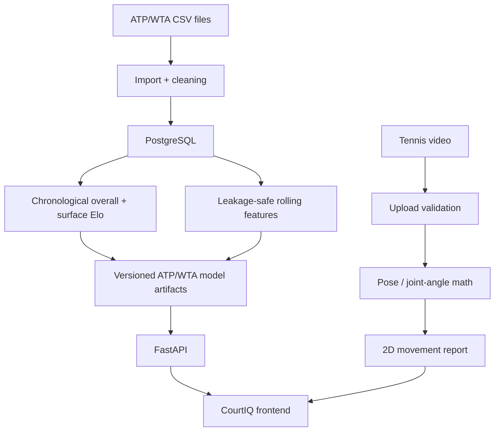

# CourtIQ

A local, research-backed tennis analytics prototype combining:

- historical match-data ingestion
- surface-aware Elo rating math
- explainable ATP/WTA match prediction artifacts
- Monte Carlo simulation
- 2D pose-landmark movement analysis
- production-minded API safety and validation

CourtIQ is intentionally honest: ATP and WTA use separate trained artifacts and separate rating pools. The current WTA artifact is trained only from the WTA files present in `work/tennis-data/wta/`; add newer files there and rebuild before claiming newer coverage.


## Quick start

Run the supported local app server:

```bash
python scripts/run_courtiq.py
```

Open:

```text
http://127.0.0.1:8000
```

Do not use the `file://` page for predictor testing; the HTTP launcher serves the frontend and backend from the same origin.

## Quick demo

- App: `http://127.0.0.1:8000`
- Product walkthrough: `DEMO.md`
- Algorithms: `ALGORITHMS.md`
- Production-readiness report: `PRODUCTION_READINESS.md`

## Why this is technically interesting

- Uses chronological evaluation design instead of random train/test splitting.
- Models player strength with overall Elo plus hard/clay/grass surface Elo.
- Separates demo predictions from validated model metrics to avoid fake accuracy.
- Implements tennis scoring math: point → game → set → match probability.
- Includes deterministic Monte Carlo simulation with measured runtime.
- Provides 2D pose-landmark geometry for coaching-oriented movement review; it is not lab-grade biomechanics.
- Adds production-minded guardrails: request IDs, standardized errors, rate limits, CORS config and video-upload validation.

## Current measured project stats

Generated by:

```bash
python3 scripts/project_stats.py
```

Latest local values:

| Metric | Value |
|---|---:|
| Historical matches processed in this checkout | 78,091 |
| Backtest status | `ok` |
| Model features defined | 24 |
| Automated tests | Run the canonical command below for the current count |
| Frontend gear products defined | 83 |
| Python source files | 46 |
| Frontend JavaScript | Vanilla ES modules |
| Database tables defined | 12 |
| CI workflow present | yes |
| Docker Compose present | yes |

## Current measured benchmarks

Generated by:

```bash
python3 scripts/benchmark_core.py
python3 scripts/benchmark_simulation.py
```

Latest local values from `output/benchmarks/core_benchmarks.json`:

| Benchmark | Workload | Runtime |
|---|---:|---:|
| Data preprocessing | 10,000 rows | 15.012 ms |
| Elo updates | 10,000 matches | 6.219 ms |
| Feature generation | 10,000 rows | 11.297 ms |
| Prediction math | 10,000 calls | 12.000 ms |
| Tournament simulation proxy | 10,000 brackets | 203.743 ms |
| Pose joint-angle math | 100,000 angles | 18.277 ms |

Benchmarks are historical snapshots from the recorded machine and are not latency guarantees. Use the project virtual environment for API checks.

Monte Carlo match benchmark from `output/benchmarks/simulation_benchmark.json`:

| Simulations | Runtime |
|---:|---:|
| 1,000 | 1.07 ms |
| 10,000 | 10.21 ms |

## Architecture



Architecture details: `docs/current_architecture.md` and `docs/architecture_diagrams.md`.

## Tech stack

- Frontend: static HTML, CSS and vanilla JavaScript modules in `outputs/tennis-ai-app`
- Backend: FastAPI, Pydantic, Python service layer
- Database target: PostgreSQL
- Data/ML foundation: chronological Elo, leakage-safe feature definitions, evaluation metrics
- Testing/quality: Python unit tests, JavaScript syntax checks, GitHub Actions CI
- Deployment foundation: Dockerfile and Docker Compose

## Data pipeline

Target input: public ATP/WTA-style match CSV files where legally and practically appropriate.

Expected local directory:

```text
work/tennis-data/
  atp_matches_YYYY.csv
  wta_matches_YYYY.csv
  atp/
    atp_matches_YYYY.csv
  wta/
    wta_matches_YYYY.csv
    wta.csv
```

ATP and WTA are kept as separate rating populations by the `tour` key. To rebuild:

```bash
python scripts/train_models.py --tour atp
python scripts/train_models.py --tour wta
python scripts/train_models.py --tour all
```

If WTA files are absent, the WTA command exits clearly instead of fabricating a model.

## Model and product boundaries

- The checked-in ATP artifact reports a 2025 held-out accuracy of 0.655, log loss 0.6185, Brier score 0.2154 and ROC-AUC 0.7132. The WTA artifact reports 0.6469, 0.6232, 0.2172 and 0.7069 respectively. These are artifact metadata, not guarantees for future matches.
- The retired ~70% ATP result is invalid because same-tournament temporal leakage contaminated that evaluation. The final [TENSOR v3 report](output/research/tensor_v3/FINAL_RESEARCH_REPORT.md) and [temporal-sensitivity methodology](output/research/temporal_sensitivity/METHODOLOGY.md) preserve the authoritative research record.
- Artifact state is serialized at a stated cutoff. An `as_of` request does not reconstruct historical player state; the API returns an explicit diagnostic when that limitation applies.
- Live prediction cannot know pre-match rest, workload or head-to-head inputs from a player name alone. Those fields use documented neutral defaults rather than fabricated observations; see `docs/feature_availability.md`.
- Analyze uses a single-camera 2D pose estimate. It does not measure ball speed, spin, forces, injury risk or clinical biomechanics.
- Profile and plan persistence use browser-local storage. CourtIQ does not currently provide authenticated accounts or cloud synchronization.

## Canonical validation

```bash
node --check outputs/tennis-ai-app/app.js
.venv/bin/python -m pytest -q
```

## Core algorithms

Documented in `ALGORITHMS.md`:

- Elo expected score
- Surface Elo blending
- Recency weighting
- Rolling features
- Point-to-game probability
- Best-of-3 / best-of-5 match probability
- Monte Carlo simulation
- Calibration metrics
- Pose joint-angle calculation

## API overview

Implemented routes include:

- `GET /health`
- `GET /api/model/version`
- `GET /api/model/metrics`
- `GET /api/players/search`
- `GET /api/players/{player_id}`
- `GET /api/players/{player_id}/ratings`
- `GET /api/players/{player_id}/form`
- `POST /api/predict`
- `GET /api/head-to-head`
- `POST /api/video/validate-upload`
- `POST /api/simulate/tournament`

Without a validated historical model, `/api/predict` returns `503` by default. For UI testing only, send `allow_demo: true` or set `COURTIQ_ALLOW_DEMO=true`.

## Database architecture

Schema: `backend/database/schema.sql`

Migration snapshot: `backend/database/migrations/001_initial_schema.sql`

The schema supports players, aliases, tournaments, matches, match statistics, point events, Elo history, model versions, model predictions, model backtests, player surface snapshots and temporary upload-analysis jobs.

## Setup

Frontend:

```text
python scripts/run_courtiq.py
```

Backend:

```bash
python -m pip install -r requirements-dev.txt
python scripts/run_courtiq.py
```

Docker:

```bash
docker compose up --build
```

Tests and checks:

```bash
python3 -m unittest discover -s tests
python3 -m py_compile backend/app/*.py backend/app/api/*.py backend/app/services/*.py backend/app/schemas/*.py scripts/*.py ml/features/*.py ml/evaluation/*.py ml/training/*.py
node --check outputs/tennis-ai-app/app.js
node --check work/backtest_courtiq_model.js
```

## Current limitations

- WTA prediction is only as current as the CSVs in `work/tennis-data/wta/` and the rebuilt `output/models/courtiq_model_wta.json` artifact.
- Gear photos should use rights-safe official or licensed product media only.
- Browser/server QA should use the HTTP launcher, not the `file://` fallback.

## Project documentation

- `DEMO.md` — concise product and technical walkthroughs.
- `ALGORITHMS.md` — formulas, assumptions, complexity and limitations.
- `PRODUCTION_READINESS.md` — security, reliability and operational review.
- `SECURITY.md` — active HTTP boundaries, controls and accepted security limitations.
