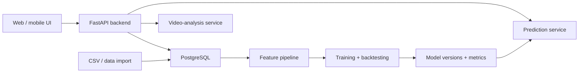
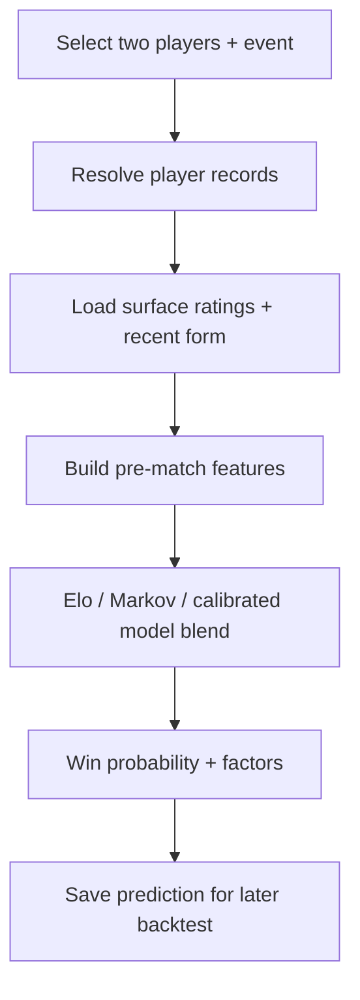

# CourtIQ Architecture Diagrams

## Target system

```mermaid
flowchart LR
  UI["Web / mobile UI"] --> API["FastAPI backend"]
  API --> DB["PostgreSQL"]
  API --> Model["Prediction service"]
  API --> Video["Video-analysis service"]
  Import["CSV / data import"] --> DB
  DB --> Features["Feature pipeline"]
  Features --> Train["Training + backtesting"]
  Train --> ModelRegistry["Model versions + metrics"]
  ModelRegistry --> Model
```

## Prediction path

```mermaid
flowchart TD
  A["Select two players + event"] --> B["Resolve player records"]
  B --> C["Load surface ratings + recent form"]
  C --> D["Build pre-match features"]
  D --> E["Elo / Markov / calibrated model blend"]
  E --> F["Win probability + factors"]
  F --> G["Save prediction for later backtest"]
```
