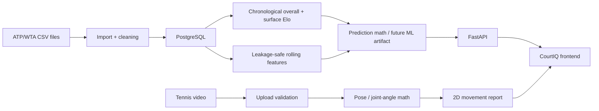

# CourtIQ architecture in 60 seconds

CourtIQ has two main flows: historical match prediction and video-based player development.

## Interview explanation

The data side starts with historical ATP/WTA-style CSV files. Those are imported into a normalized PostgreSQL schema for players, tournaments, matches, point events and model backtests. Player strength is updated chronologically with overall and surface-specific Elo, so the system can predict a match using only information that existed before that match. The backend is FastAPI because it gives strict request validation and a clean ML-friendly Python service layer. The frontend is a static product prototype that demonstrates the experience.

The video side is intentionally scoped: the current implementation has safe upload validation and joint-angle math. It does not claim full ball tracking or RPM.

## What to emphasize

- Chronological evaluation prevents future-data leakage.
- Surface-specific Elo is more tennis-aware than a single global rating.
- Probability quality matters, so the planned metrics include Brier score, log loss and calibration.
- The project refuses to display fake model accuracy when real historical data is not loaded.
